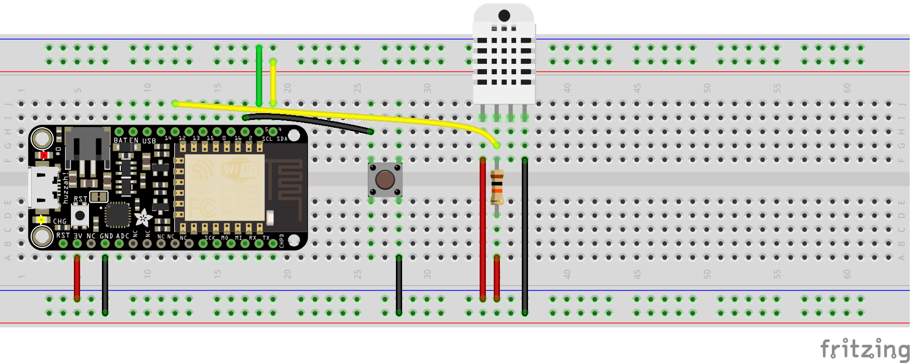
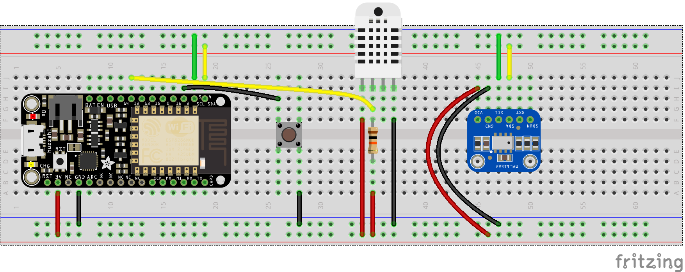
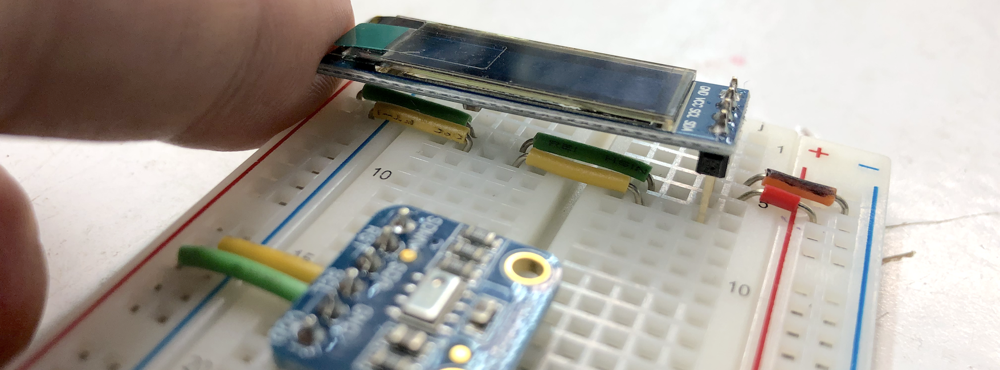

# A3: A Weather Station
I am using the following topics for the MQTT server:
1. Treasure/temperature
2. Treasure/humidity
3. Treasure/pressure

## Libraries required
1. DHT sensor library by Adafruit
2. MPL115A2 by Adafruit
3. Adafruit GFX library by Adafruit
4. Adafruit SSD1306 by Adafruit
5. PubSubClient by Nick O'Leary

## Download Client
Download the [MQTT Client](http://mqttfx.jensd.de) to monitor MQTT connections. 

## Schematic
### DHT22

### MPL115A2

### OLED Display
